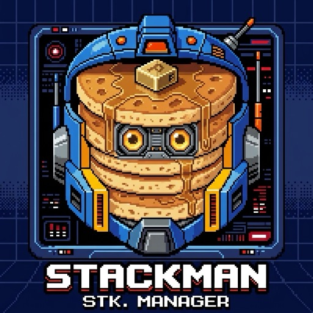

# Stackman



Stackman manages stacked Git branches. You record which branches sit on which parent; Stackman stores that in a small SQLite database, shows you the stack, and rebases the whole thing with one command.

It is branch-first. Every command takes an optional `BRANCH`, works from any worktree of the repository, and defaults to the currently checked-out branch. Stackman only records parent/fork-point metadata in its own database. It never creates, deletes, or checks out Git branches.

## Installation

Requires Python 3.12. Stackman ships as a Nix flake or an installable Python package. Source lives at [github.com/napisani/stackman](https://github.com/napisani/stackman).

**Nix:**

```bash
nix run github:napisani/stackman -- --help
```

The author's `dotfiles-nix` configuration installs the same flake package through Home Manager.

**Python package** (from a clone of the repo):

```bash
git clone https://github.com/napisani/stackman.git
cd stackman
uv tool install .     # or: pip install .
```

## Quick Start

```bash
# Track the current branch onto main
stackman track --parent main

# Track another branch onto the first
stackman track feature-2 --parent feature

# See the stack
stackman list
# main
# └── feature
#     └── feature-2

# Rebase every branch in the stack onto its parent's latest tip
stackman sync

# A branch landed: lift its children onto its parent
stackman done feature

# Stop tracking a branch (children keep their old parent)
stackman forget feature
```

## How It Works

When you track a branch, Stackman records two things: its parent, and the **fork-point** — the commit where the branch diverged from the parent.

```bash
stackman track feature --parent main
# fork-point = main's tip at that moment
```

`stackman sync` rebases everything after the fork-point onto the parent's current tip, one branch at a time, and force-pushes with lease. The fork-point is stored, not guessed, so a manual push between syncs never confuses it.

The database lives at `~/.local/share/stackman/stackman.db` (or `$XDG_DATA_HOME/stackman/stackman.db` when set). All worktrees of a repo share it.

## Commands

### `stackman track [BRANCH] --parent PARENT`

Register a branch with its parent and fork point. `BRANCH` defaults to the current branch.

```bash
stackman track feature --parent main
# Tracked branch 'feature' with parent 'main' at ee9a374.
```

Both branches must exist locally. Re-tracking a branch updates its parent and fork-point.

### `stackman chain ANCHOR BRANCH...`

Record an existing linear stack in one call. `ANCHOR` is not tracked; every later branch points at the previous item.

```bash
stackman chain main a b c
# Tracked stack chain 'main' -> 'a' -> 'b' -> 'c'.
```

### `stackman sync [BRANCH]`

Rebase the whole stack containing `BRANCH` (default: current). Runs the stack in order from the root, so each branch rebases onto the freshly-updated parent. When `origin` is configured, sync first fetches it and fast-forwards the invoking branch with `git pull --ff-only`; a successful fetch makes `origin/<anchor>` the root rebase target. Fetch/pull failures warn and fall back to local refs.

```bash
stackman sync feature
```

Options:

| Option | What it does |
|--------|--------------|
| `--dry-run` | Show the resolved sync set and planned steps without touching the repo. |
| `-v, --verbose` | Print the exact git rebase command for each branch. |
| `--squash` | Squash 2+ commits after the fork-point into one before rebasing each branch. |
| `--allow-dirty` | Skip the dirty-worktree preflight. Git may still abort checkout or rebase. |
| `--no-fetch-and-pull` | Skip the best-effort `origin` fetch and fast-forward-only pull. |
| `--resolver CMD` | Resolve conflicts non-interactively with `CMD` (overrides `STACKMAN_RESOLVER`). |
| `--no-wait` | Force non-interactive mode; don't wait for TTY input on conflict. |

### `stackman done [BRANCH]`

Mark a branch as done: remove it from tracking and reparent its children onto its recorded parent. Git branches are untouched.

```bash
stackman done feature
# Marked 'feature' done: reparented [feature-2] onto 'main' and removed it from stackman tracking (Git branches unchanged).
```

Use `--dry-run` to preview the reparenting first.

### `stackman forget [BRANCH]`

Stop tracking a branch without reparenting children. The children may still record the forgotten branch as parent.

```bash
stackman forget feature
```

Bulk forms:

```bash
stackman forget --all                    # forget every tracked branch in this repo
stackman forget --all --global           # forget tracking in every repo in the database
stackman forget --all --dry-run          # list what would be forgotten
stackman forget --all -y                 # skip the confirmation prompt
```

### `stackman list [--json]`

Show the tracked branches in this repo as a stack tree rooted at each anchor. The current branch is marked `(current)`.

```bash
stackman list
# Tracked branches in /path/to/repo
# Worktree: /path/to/repo
# main
# └── feature
#     └── feature-2
```

`--json` emits one machine-readable object to stdout and nothing else.

### `stackman status [BRANCH] [--json]`

Show tracking status for a branch. Without `--json`, exits non-zero when the branch isn't tracked; `--json` always exits 0 and reports `tracked: true/false`.

```bash
stackman status feature
# branch: feature
# worktree: /path/to/repo
# parent: main
# fork-point: ee9a374806eebf16a2228cdaff9f9fa36ef5d6ba
```

### `stackman gh discover PR_NUMBER [--apply]`

Discover a PR stack from GitHub, using the `gh` CLI. Walks upward from the PR through base branches to the anchor, then prints the whole subtree.

```bash
stackman gh discover 3
# Discovered PR stack from PR #3 (feature-c):
# main
# └── feature-a (#1)
#     └── feature-b (#2)
#         └── feature-c (#3)
#
# Plan:
#   stackman track feature-a --parent main
#   stackman track feature-b --parent feature-a
#   stackman track feature-c --parent feature-b
# Run with --apply to update Stackman tracking.
```

Read-only by default. `--apply` writes the tracking metadata; branches that don't exist locally are skipped.

### `stackman gh discover-mine [--apply]`

Configure every open PR authored by you as a tracked stack, in one command. Runs `gh pr list --author @me` and tracks each PR's head branch onto its base branch, forming one or more stacks.

```bash
stackman gh discover-mine
# Discovered 3 open pull request(s) authored by you:
# main
# └── feat/x (#10)
#     └── feat/y (#11)
#         └── feat/z (#12)
#
# Plan:
#   stackman track feat/x --parent main
#   stackman track feat/y --parent feat/x
#   stackman track feat/z --parent feat/y
# Run with --apply to update Stackman tracking.
```

Read-only by default. `--apply` writes the metadata. PRs whose head or base branches aren't checked out locally are skipped. Colleagues' PRs are filtered out; only yours are included.

These two commands are the only ones that need `gh`. Everything else works without it.

### Worked example: import your open PRs, then sync the stack

```bash
# Drop all tracking in this repo, including branches whose PRs already merged
stackman forget --all -y

# Re-import what's actually open: every PR you have, as a Stackman stack
stackman gh discover-mine --apply

# Rebase the whole stack onto the latest parents, resolving conflicts with Claude
stackman sync feature --resolver "claude -p @prompt"
```

That's the full loop. `forget --all` clears stale tracking (merged PRs, renamed branches); `discover-mine` rebuilds it from GitHub in one shot; `sync` rebases every branch in the stack, in order, onto its parent's latest tip.

Every step is non-interactive. No TTY is required, and `--resolver` settles conflicts without a human at the terminal, so the entire rebase runs unattended. An agent session can finish its edits, run `stackman sync --resolver "claude -p @prompt"` as its last step, and get a fully rebased, force-pushed stack without ever pausing for an interactive prompt or a manual `git rebase --continue`. The stack updates underneath you; nothing waits on input.

### `stackman show-resolver-prompt [--template]`

Print the default conflict-resolution prompt, with your branch context filled in. `--template` shows the raw template with `{VAR}` placeholders.

```bash
stackman show-resolver-prompt
stackman show-resolver-prompt --template
```

## Conflict Resolution

`stackman sync` rebases your branches. When a rebase hits a conflict, you resolve it one of two ways.

### Interactive (default)

Stackman waits while you resolve manually:

```
[stackman] Resolve conflicts, run `git rebase --continue` or `git rebase --abort`, then press Enter to resume.
```

Resolve, run `git rebase --continue`, press Enter.

### Automatic with a resolver

Set `STACKMAN_RESOLVER` (or pass `--resolver`) to a command that reads the conflict context from environment variables, resolves, and runs `git rebase --continue` (or exits non-zero to abort).

```bash
export STACKMAN_RESOLVER="claude -p @prompt"
stackman sync feature
```

The `@prompt` token expands to Stackman's default conflict-resolution prompt, with branch name, parent, conflicted files, and exit criteria already filled in.

```bash
stackman sync --resolver "claude -p @prompt"            # one-off override
stackman sync --resolver "~/.local/bin/my-resolver"      # custom script
```

Extend the prompt with project-specific rules:

```bash
PROMPT="$(stackman show-resolver-prompt)"
PROMPT="${PROMPT}

## Our Code Standards
- Always preserve TypeScript types
- React hooks first, no class components
- If unsure, check recent commits"

stackman sync --resolver "claude -p \"$PROMPT\""
```

See [resolver-examples.md](docs/resolver-examples.md) for ready-to-use scripts, and [conflict-resolution-guide.md](docs/conflict-resolution-guide.md) for the full setup guide.

## Environment Variables

### `STACKMAN_RESOLVER`

Default resolver command for non-interactive conflict resolution. Overridden by `--resolver`.

### Resolver context (set by Stackman)

When your resolver runs, it receives the conflict context as environment variables:

| Variable | Contents |
|----------|----------|
| `STACKMAN_BRANCH` | Branch being rebased |
| `STACKMAN_PARENT` | Parent branch name |
| `STACKMAN_PARENT_TIP` | SHA of parent's tip |
| `STACKMAN_FORK_POINT` | SHA where branch forked from parent |
| `STACKMAN_CONFLICTED_FILES` | Newline-separated list of conflicted files |
| `STACKMAN_OPERATION` | Always `"rebase"` |
| `STACKMAN_REPO_URL` | Origin URL (if configured) |
| `STACKMAN_PARENT_PR_NUMBER` | GitHub PR number for parent (if available) |
| `STACKMAN_PR_NUMBER` | GitHub PR number for branch (if available) |

## Global Options

`--db-path` and `--repo` work before or after the subcommand:

```bash
stackman --repo /path/to/repo list
stackman list --repo /path/to/repo      # same thing
```

- `--db-path PATH` — use a different database (default: `~/.local/share/stackman/stackman.db`)
- `--repo PATH` — work with a specific repository (default: current directory)
- `-V, --version` — show the version

Every command is fully non-interactive; a TTY is never required. Add `--json` to `list` or `status` for machine-readable output.

## FAQ

**Does Stackman delete or rename branches?**
No. It only records parent/fork-point metadata. Git branches are never modified.

**What if I push a branch manually between syncs?**
The fork-point doesn't change. The next sync rebases onto the parent's current tip and uses `--force-with-lease`, so it fails safely if someone else pushed.

**Can I use Stackman with multiple worktrees?**
Yes. All worktrees of a repo share the same database, so you can sync from any worktree.

**What if my resolver fails?**
The rebase is aborted and `stackman sync` exits non-zero. You resolve manually and retry.

**How do I stop using Stackman?**
Run `stackman forget --all`. Your Git branches are unaffected.

## Development

Stackman uses Python 3.12 with uv, Ruff, ty, and pytest:

```bash
nix develop   # optional pinned toolchain
make sync
make check
```

See [AGENTS.md](./AGENTS.md) for the complete development guidelines and [design.md](docs/design.md) for the architecture.

## License

MIT. See [LICENSE](./LICENSE).
